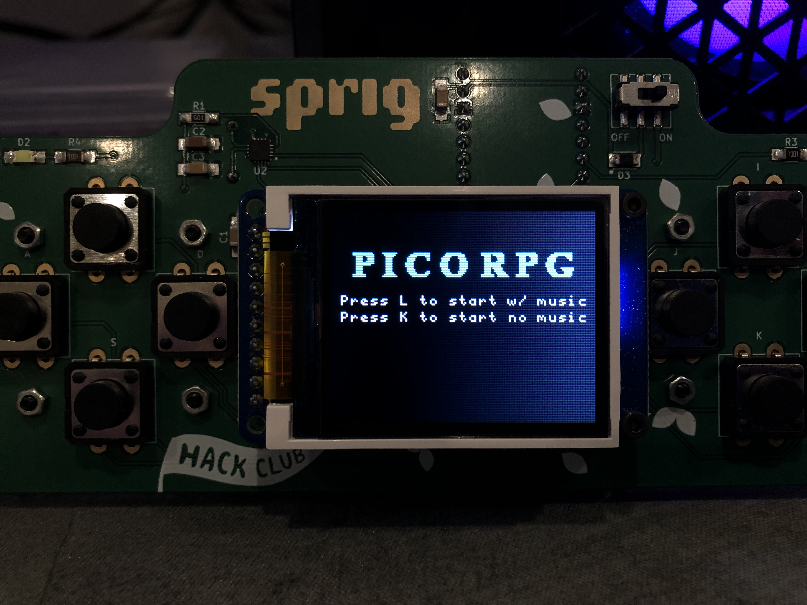

# PicoRPG
This is a WIP RPG game that runs on the Hack Club Sprig, a RP2040 based game console. [Demo Video](/static/PicoRPGdemo.mp4)

## How to run
- Download a .uf2 binary from [releases](https://github.com/ColinVanderMeer/PicoGame/releases/latest) or compile a version yourself
- Hold the BOOTSEL button on the back of the sprig and plug it in
- Drag and drop the .uf2 file onto the RPI-RP2 drive

#### Claude Sonnet 3.5 was used for general ideas of how to implement game mechanics

## Third party
- [hagl](https://github.com/tuupola/hagl)
- [pico-mod-player](https://github.com/moefh/pico-mod-player)
- Music: [hymn to aurora](https://modarchive.org/index.php?request=view_by_moduleid&query=99684)
- Player Sprites: [Toby Fox](https://undertale.com/)

